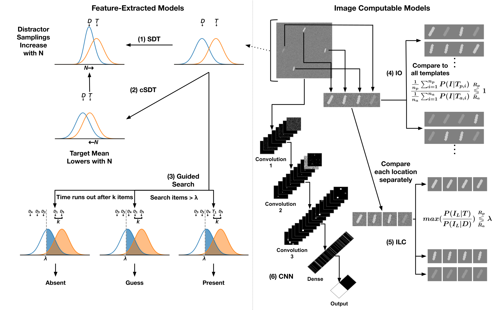

# Search
Python implementation of Various Search Models
<p align="center">
  
</p>

```
@article{ Coming Soon!
}
```

### Installation 

To clone the repository, use:
 ```
 git clone https://github.com/anshksoni/Search.git
 ```

You can create a conda environment to run the code with:

```
conda env create -f env.yml
```


### Usage

Each model is implemented within the Jupyter Notebook: ModelObserversTutorial.ipynb. All models are available through simulation and, if possible, analytically.
Each model is set to take its fitting parameters and output performances for set sizes 1-12 for both features (angle or luminance) and conjunction.
Stimuli parameters can also be changed, including the max set size in the Stimuli Gen section of the Jupyter Notebook.
Reach out to asoni@ucsb.edu if you have any questions or would like to see the implementation of another model.


### License

This project is released under MIT License, which allows commercial use. See [LICENSE](LICENSE) for details.
